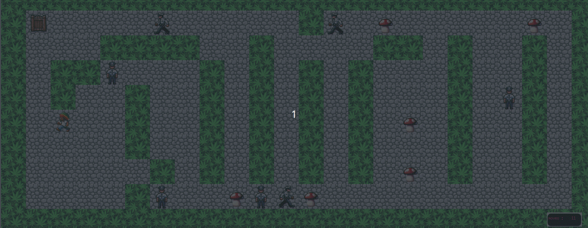
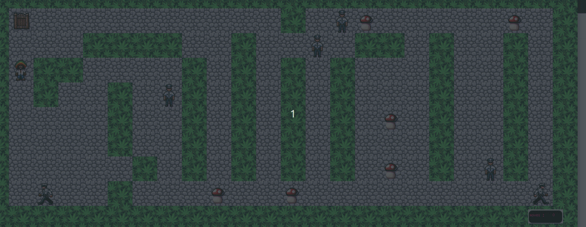
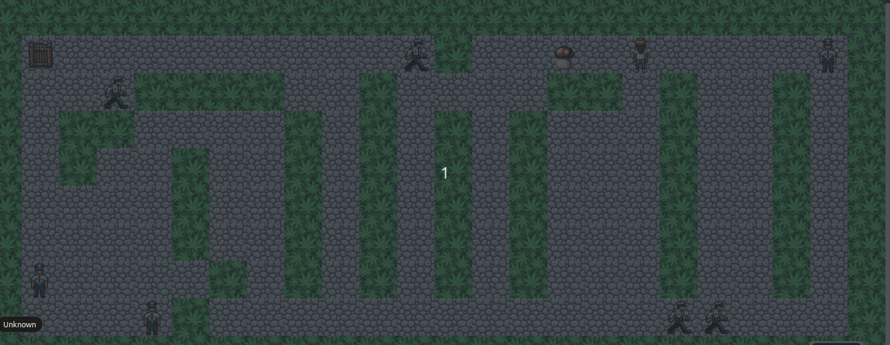

# So_Long

## 2D Game Project

This project is part of the curriculum at 42 School, focused on developing a 2D game. The primary objective is to create a game using the "minilibx" graphics library.



---



---


## game objective

The player must collect all the items scattered throughout the game and find their way to the escape gate. The challenge is to achieve this with the minimum number of movements.

## Table of Contents

- [Compilation](#Compilation)
- [Usage](#usage)
- [Game_instruction](#Game_instruction)
- [Supported Operating Systems](#OS)

## Compilation

To compile the game, use the following command:

```bash
make
```

## Usage

to test the game run the command :

```bash
make test
```

## Game_instruction

Control the player using the keyboard:

| Key        | Action                           |
|------------|----------------------------------|
| Up         | Move the player up               |
| Down       | Move the player down             |
| Right      | Move the player to the right     |
| Left       | Move the player to the left      |
| Escape     | Press the "ESC" key or click the close button in the window |

## mode of use

to launch the game please use : "./so_long <map_name>.ber"
All maps are included in a folder name "maps"
an example:

```shell
./so_long maps/test_nada.ber
```

If you wish to test a faster version of the game(you know , because of the fun), try using rule
```bash
make faster
```

or alternatively, if your having a bad luck
```bash
make slower
```

and than run for example
```bash
make test
```

## input map

To launch the game, please use a text file ending with .ber . The map will contain only a ser of specific charachters:
'0' : for empty path
'1' : for a wall
'C' : for a collectible
'P' : players starting coordination (only one charachter on the map is allowed)
'E' : exit coordinate (only one charachter on the map is allowed)

## Supported Operating Systems

The game is compatible with both macOS and Linux systems.
The version of the graphic library included in this repo are :
minilibx-linux: 2011
minilibx-macos: 2019
---

feel free to contact me
